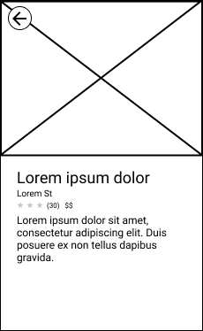

# Task List

You may do these tasks in any order, but take note that they are listed in the order your team has prioritized completing them.

Reminder that you are NOT expected to complete all tasks. You are expected to write clean, readable code. Remember to add comments explaining what you were working on if you run out of time in the middle of a task.

## Task 1

Your team needs to query some JSON API endpoints to pull in place and image data. This functionality should get a list of places from the server, and get an image for each place, so that images can be displayed alongside places. In `PlaceFetcher.swift`, implement:

**static func loadPlacesWithImages() async throws -> [Place]**

This method should load the place list data by making a GET request to `https://api.byteboard.dev/data/places` and combine the data with image URLs by making GET requests to `https://api.byteboard.dev/data/img/{placeId}`, returning an array of `Place` structs containing all essential place data.

## Task 2

Users should be able to filter which places they see using the search bar. In `PlaceListView.swift`, implement:

**var filteredPlaces: [Place]**

to return places that match the input filter string.

## Task 3

When a user selects a place on the list of places, they should be able to then view all the details associated with that place. If you tap on a place now, you'll see `PlaceDetailsView`, which needs its layout to be completed with properly loaded in data.

Implement the rest of `PlaceDetailsView.swift` to match the wireframe in `wireframe.png` (shown below).

